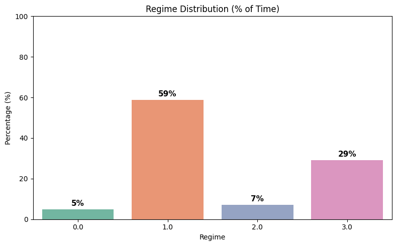
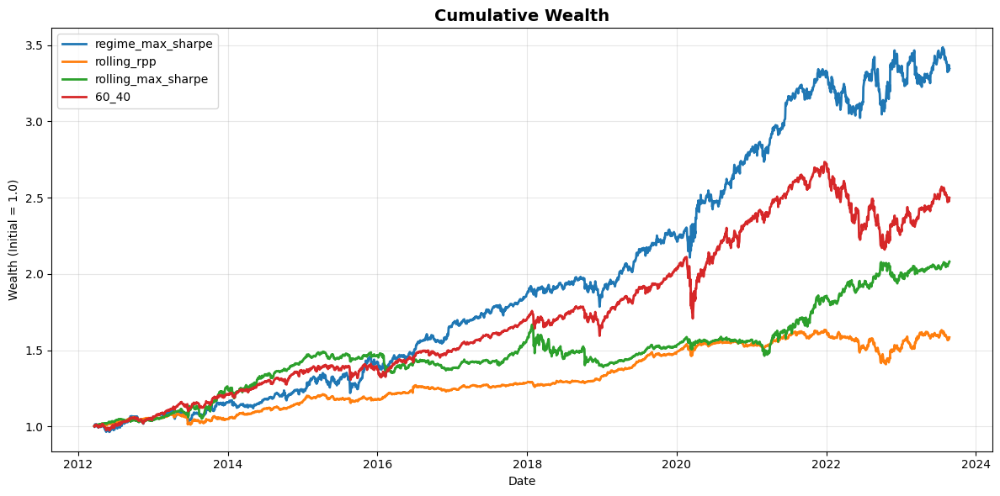
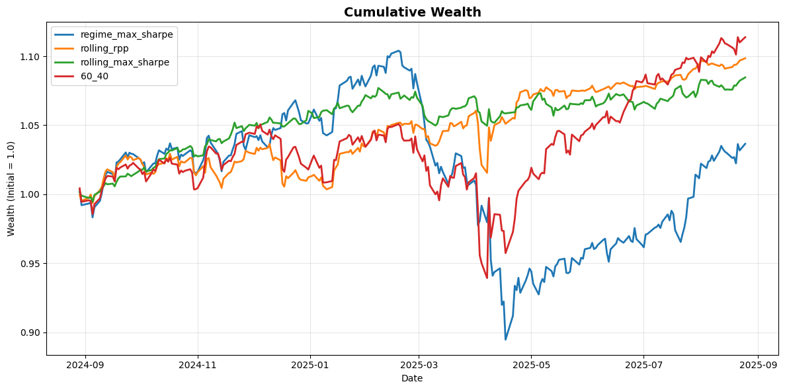
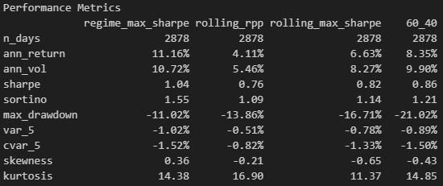
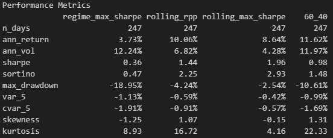
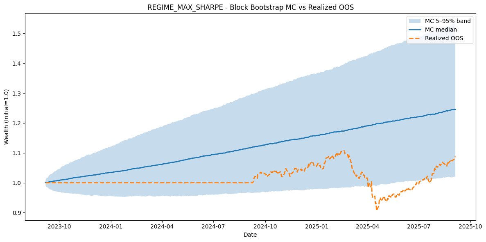
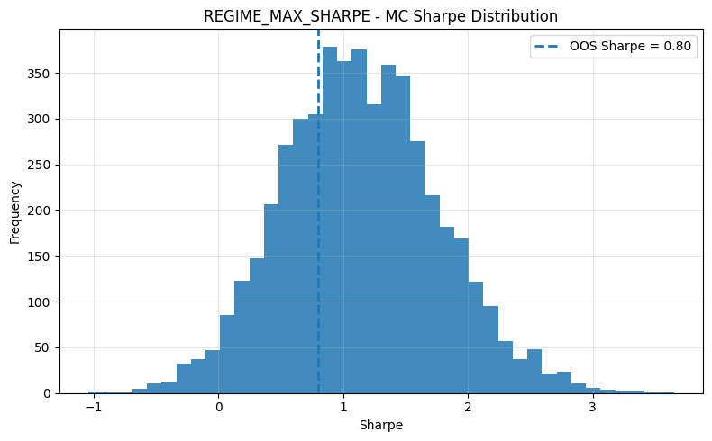

# Regime-Aware Asset Allocation

This project detects market regimes using Gaussian Mixture Models (GMM) on asset+macro features, then allocates across SPY, IEF (bonds), GLD (gold), and UUP (USD) with regime-conditional weights. It includes in-sample (IS) / out-of-sample (OOS) evaluation, rolling baselines (risk parity & max-Sharpe), a 60/40 benchmark, and block-bootstrap Monte Carlo stress tests.

---

## Overview

- **Data**

  - **Assets (Yahoo Finance):** SPY (US equities), IEF (7–10Y Treasuries), GLD (gold), UUP (USD), ^VIX
  - **Macro (FRED):** CPIAUCSL (CPI), UNRATE (Unemployment), T10Y2Y (10Y–2Y spread), GDPC1 (Real GDP)
  - **Dates:** IS/OOS split is controlled by `out_of_sample_years` (default 2 years)

- **Modeling Steps**

  1. **Feature engineering:** daily log returns & rolling vol for assets; add VIX; macro features (CPI YoY, GDP YoY, UNRATE, T10Y2Y) forward-filled to daily.
  2. **Standardization:** `StandardScaler` within each rolling GMM window to avoid look-ahead.
  3. **GMM regime detection (walk-forward):** fit on rolling windows; predict next step; number of components chosen by average BIC.
  4. **Label join:** merge predicted `regime` back into the feature set;

- **Trading Strategy**

  - **Regime-conditional max-Sharpe allocation:** For each detected regime, solve a constrained mean-variance problem (maximize Sharpe; sum of weights = 1; per-asset bounds \[-1, 1\]) on IS returns to obtain weights over \{SPY, BONDS, GOLD, USD\}.
  - **Execution:** On each date, use the weight vector for the current regime to compute portfolio returns.
  - **Baselines:** (i) Rolling Risk Parity (long-only, equal risk contributions), (ii) Rolling Max-Sharpe (unconstrained \[-1,1\]), (iii) 60/40 (SPY/IEF).

- **Backtesting**
  - **IS/OOS split:** IS up to `end_date`, OOS thereafter (last `out_of_sample_years`).
  - **Walk-forward mechanics:** Regimes are predicted out-of-sample, weights are regime-specific but estimated using IS data only.
  - **Metrics:** Annualized return/volatility, Sharpe, Sortino, max drawdown, 5% VaR/CVaR, skewness, kurtosis.

---

## Results

### Regime Diagnostics

- **Regime Distribution**

  

---

### Strategy Backtests

- **In-Sample Equity Curve**

  

- **Out-of-Sample Equity Curve**

  

---

### Performance Tables

- **In-Sample Performance**

  

- **Out-of-Sample Performance**

  

---

### Robustness Checks

- **Bootstrap Wealth vs OOS**  
  

- **Sharpe Ratio Distribution**  
  

---

## Tech Stack

- **Python:** `pandas`, `numpy`, `matplotlib`, `seaborn`, `scikit-learn`, `scipy`, `yfinance`, `fredapi`, `python-dotenv`
- **Methods:** Gaussian Mixture Models, mean-variance optimization, risk-parity, bootstrap Monte Carlo Simulation
